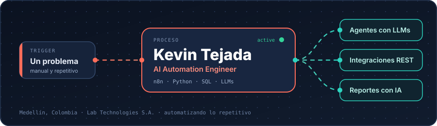
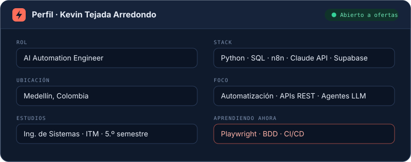

 

**Convierto procesos manuales en flujos que funcionan solos.**
Automatización · Integraciones REST · Agentes con IA

 

## ⚡ Perfil

  

Empecé como operador y analista de datos, y de ahí pasé a automatizar lo que antes se hacía a mano. Hoy diseño flujos con **n8n**, conecto sistemas por **APIs REST** y construyo agentes con **Claude** y **OpenAI** que reducen tiempos de respuesta y cuidan la calidad de la información entre plataformas.

---

## 🔌 Mi stack, visto como un workflow

  
<table>
  <tr>
    <th align="center">📥 Entrada</th>
    <th align="center">⚙️ Proceso</th>
    <th align="center">📤 Salida</th>
  </tr>
  <tr>
    <td valign="top">
      REST APIs 
      Webhooks 
      WhatsApp Business API 
      Web scraping autorizado 
      Postman para probar
    </td>
    <td valign="top">
      <b>n8n</b> (avanzado) 
      Python · SQL 
      Claude API · OpenAI API 
      RAG y búsqueda híbrida 
      Git / GitHub · Docker (básico)
    </td>
    <td valign="top">
      Supabase · PostgreSQL 
      Next.js · React · Vercel 
      Power BI · Looker Studio 
      ElevenLabs (agentes de voz)
    </td>
  </tr>
</table>

  

---

## 🧩 Workflows destacados

| Workflow | Qué resuelve | Con qué |
| --- | --- | --- |
| 🎙️ **Agente de voz conversacional** | Atiende usuarios por voz con síntesis natural, conectado a flujos de atención automatizados | n8n · ElevenLabs · Vercel · Supabase |
| 💬 **Asistente de soporte con RAG** | Chatbot en WhatsApp con búsqueda híbrida (vectorial + texto), atención por niveles y escalación a mesa de ayuda | LLMs · embeddings · WhatsApp Business API |
| 🔐 **Plataforma web segura** | Portal para usuarios externos con control de acceso por fila (RLS), escritura validada en servidor y sesión única | Next.js · Supabase |
| 📋 **Briefing operativo con IA** | Cruza llamadas, ubicación de activos y tickets, y entrega al equipo entrante un reporte priorizado por urgencia | n8n · PostgreSQL · LLMs |

> Son proyectos de mi trabajo profesional, por eso el código no es público. Los repositorios de práctica irán apareciendo aquí.

---

## 🚀 Próxima ejecución

- 🧪 **Pruebas automatizadas:** framework con Playwright + BDD (Gherkin) + GitHub Actions
- 🤖 Agentes con LLMs más robustos y flujos con mejor manejo de errores
- 🌎 Inglés técnico

---

## 📬 Hablemos

Estoy abierto a oportunidades en **automatización, integraciones, IA y QA**.

  
  
  

Hecho en Medellín 🇨🇴 · automatizando lo repetitivo

